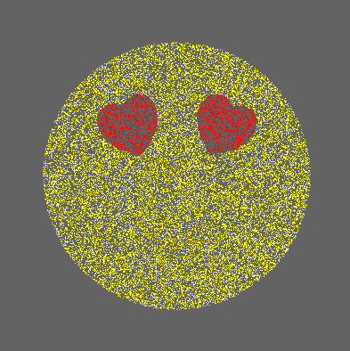
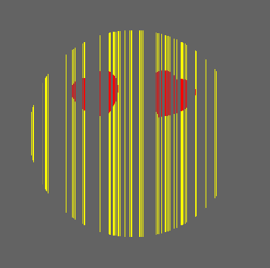
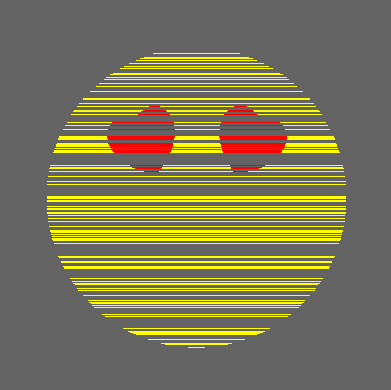

# Emoji with Tiny Code

Este proyecto tiene como objetivo desarrollar un sketch de menos de 1024 carácteres que muestre un emoji con diferentes animaciones.

## Ejecución
- [Ejecución](https://editor.p5js.org/josejuan.jjrc7/present/skSjSYsoI)

## Características

- Dibuja una imitación con el emoticono con corazones en los ojos
- Animaciones
    - Puntos
    - Barras verticales
    - Barras horizontales

## Decisiones

###### Emoji
- Se dibuja el emoji con un radio de 150 píxeles.

###### Animaciones
- Puntos

- Barras verticales

- Barras horizontales

##### Corazones
- Se utiliza la siguiente inecuación para saber si un punto se encuentra dentro del corazón:
    -  (x^2^+y^2^-1)^3^ < x^2^+y^3^
- Se aplican distintos desplazamientos y rotaciones para obtener la forma deseada.

## Herramientas utilizadas
- [Processing](https://processing.org/)
- [Editor p5.js](https://editor.p5js.org/)
- [Editor readme.md](https://dillinger.io/)

Realizado por [José Juan Reyes Cabrera](https://github.com/JoseJuanRC)
